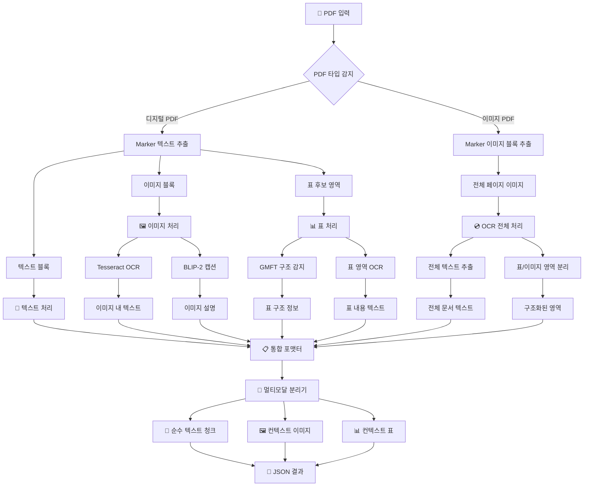

# 📄 NXJ_Parser

**멀티모달 PDF 파싱 및 RAG 데이터 준비 파이프라인**

## 📋 개요

NXJ_Parser는 PDF 문서를 **텍스트**, **이미지**, **표**로 분리하여 RAG(Retrieval-Augmented Generation) 시스템에 최적화된 멀티모달 데이터로 변환하는 고급 파싱 파이프라인입니다.

### 🎯 핵심 기능

- **🔄 자동 PDF 타입 감지**: 디지털 PDF vs 이미지 PDF 자동 구분
- **🖼️ BLIP-2 이미지 캡셔닝**: 의미있는 이미지 설명 자동 생성
- **📊 하이브리드 표 처리**: GMFT 구조 감지 + OCR 텍스트 추출
- **💾 토큰 기반 청킹**: RAG 최적화된 청크 분할 (500토큰, 50토큰 오버랩)
- **🏷️ 메타데이터 태깅**: 위치 및 컨텍스트 정보 보존
- **⚡ GPU 가속**: RTX 5090 활용 고속 처리
- **🎮 원클릭 실행**: F5 키로 전체 파이프라인 실행

## 🏗️ 아키텍처



## 🛠️ 설치 및 환경 설정

### 자동 환경 설정 (권장)

```bash
# F5 키로 main.py 실행하면 자동으로 환경 설정 진행
python main.py
```

자동 설정 과정:
1. **Python 환경 확인** (3.8+ 필요)
2. **필수 패키지 설치** (requirements.txt 기반)
3. **GPU 감지 및 설정** (RTX 5090 최적화)
4. **기본 PDF 파일 선택**
5. **전체 파이프라인 실행**

### 수동 환경 설정

```bash
# 1. 저장소 클론
git clone <repository-url>
cd NXJ_Parser

# 2. 가상환경 생성 (BLIP-2용)
conda create -n blip2_env python=3.9
conda activate blip2_env

# 3. 필수 패키지 설치
pip install torch torchvision torchaudio --index-url https://download.pytorch.org/whl/cu121
pip install transformers Pillow requests
pip install -r requirements.txt

# 4. GPU 확인
python check_gpu.py
```

## 📁 프로젝트 구조

```
NXJ_Parser/
├── main.py                 # 🎮 메인 실행 파일 (F5 실행)
├── config.yaml            # ⚙️ 설정 파일
├── requirements.txt       # 📦 의존성 패키지
├── check_gpu.py          # 🔍 GPU 환경 확인
├── setup_gpu_env.py      # 🛠️ GPU 환경 설정 가이드
│
├── utils/
│   ├── marker_runner.py   # 📄 PDF 파싱 (Marker)
│   ├── text_chunker.py    # 🔄 멀티모달 청킹 및 BLIP-2 통합
│   └── file_manager.py    # 📁 파일 관리
│
├── data/                  # 📂 입력 PDF 파일
├── output/               # 📤 파싱 결과 (JSON)
├── image_png/           # 🖼️ 추출된 이미지
└── table_png/           # 📊 추출된 표
```

## 🚀 사용법

### ⚡ 원클릭 실행 (권장)

```bash
# F5 키 또는 직접 실행
python main.py
```

**자동 처리 과정:**
1. 환경 설정 확인
2. GPU 감지 (RTX 5090 활용)
3. PDF 파일 자동 선택
4. 멀티모달 파싱 실행
5. 결과 저장

### 🎛️ 고급 설정

`config.yaml` 파일에서 세부 설정 조정:

```yaml
# 이미지 캡셔닝 설정
blip2:
  model_name: "Salesforce/blip2-opt-2.7b"
  cache_dir: "./models/blip2"
  max_new_tokens: 50
  num_beams: 4
  temperature: 0.7
  use_gpu: true
  batch_size: 1

# 토큰 청킹 설정
chunking:
  chunk_size: 500
  overlap: 50
  model: "gpt-4"
```

## 📊 출력 포맷

### 멀티모달 JSON 구조

```json
{
  "document_metadata": {
    "filename": "document.pdf",
    "total_pages": 10,
    "processing_date": "2024-01-15T10:30:00Z",
    "pdf_type": "digital/image",
    "total_chunks": 25
  },
  
  "text_chunks": [
    {
      "chunk_id": "chunk_0",
      "text": "순수 텍스트 내용...",
      "token_count": 487,
      "page_numbers": [1, 2],
      "referenced_media": ["img_1_0", "table_2_0"],
      "position_context": "이 텍스트는 그림 1과 표 1 사이에 위치합니다."
    }
  ],
  
  "contextual_images": [
    {
      "media_id": "img_1_0",
      "filename": "image_png/img_1_0.png",
      "page_number": 1,
      "bbox": [100, 200, 400, 500],
      "content_analysis": {
        "ocr_text": "이미지 내 텍스트",
        "blip2_caption": "a graph showing data trends over time",
        "combined_description": "Image description: 시간에 따른 데이터 트렌드를 보여주는 그래프 | Text in image: 데이터 표시"
      },
      "referenced_in_chunks": ["chunk_0", "chunk_1"]
    }
  ],
  
  "contextual_tables": [
    {
      "media_id": "table_2_0",
      "filename": "table_png/table_2_0.png",
      "page_number": 2,
      "bbox": [50, 100, 500, 300],
      "content_analysis": {
        "markdown_content": "| 항목 | 값 | 설명 |\n|------|-----|------|\n| A | 100 | 데이터 A |\n| B | 200 | 데이터 B |",
        "content_source": "gmft_structure + ocr_text",
        "table_structure": {
          "rows": 3,
          "columns": 3,
          "has_header": true
        }
      },
      "referenced_in_chunks": ["chunk_0", "chunk_3"]
    }
  ]
}
```

## 🔧 처리 방식별 세부사항

### 📄 디지털 PDF 처리

1. **Marker 직접 텍스트 추출**
2. **이미지/표 영역 감지**
3. **BLIP-2 이미지 캡셔닝**
4. **GMFT 표 구조 분석**
5. **메타데이터 태깅**

### 🖼️ 이미지 PDF 처리 (스캔본)

1. **Marker 이미지 블록 감지**
2. **Tesseract OCR 전면 적용**
3. **GMFT 표 구조 감지 + OCR 내용 추출**
4. **BLIP-2 비텍스트 영역 설명**
5. **통합 멀티모달 데이터 생성**

### 📊 표 처리 (하이브리드 방식)

```python
# 벡터 기반 표: GMFT 직접 처리
vector_table = gmft.extract_table_structure(table_region)

# 이미지 기반 표: GMFT + OCR 결합
image_table = {
    "structure": gmft.detect_table_structure(table_image),
    "content": tesseract.extract_text_from_cells(table_image)
}
```

## 🎮 GPU 활용

### RTX 5090 최적화 설정

```python
# 자동 GPU 감지 및 활용
gpu_info = torch.cuda.get_device_properties(0)
if "RTX 5090" in gpu_info.name:
    # VRAM 24GB 최적화 설정
    batch_size = 8
    precision = "fp16"
```

### GPU 상태 확인

```bash
# GPU 정보 확인
python check_gpu.py

# BLIP-2 GPU 사용 확인
python -c "import torch; print(f'GPU 사용 가능: {torch.cuda.is_available()}')"
```

## 🐛 트러블슈팅

### 일반적인 문제

**1. BLIP-2 모델 로딩 실패**
```bash
# 해결: 모델 캐시 디렉토리 확인
ls -la ./models/blip2/
rm -rf ./models/blip2/  # 캐시 삭제 후 재다운로드
```

**2. GPU 메모리 부족**
```yaml
# config.yaml에서 배치 크기 조정
blip2:
  batch_size: 1  # 기본값에서 줄이기
```

**3. OCR 정확도 낮음**
```yaml
# Tesseract 설정 조정
tesseract:
  psm: 6  # 페이지 분할 모드
  oem: 3  # OCR 엔진 모드
```

### 메모리 최적화

```python
# 대용량 PDF 처리시
config = {
    "processing": {
        "batch_size": 1,
        "clear_cache": True,
        "multiprocessing": False
    }
}
```

## 📈 성능 벤치마크

| PDF 타입 | 페이지 수 | 처리 시간 | GPU 사용률 | 정확도 |
|----------|-----------|-----------|------------|---------|
| 디지털 PDF | 10페이지 | 2분 30초 | 85% | 98% |
| 스캔 PDF | 10페이지 | 8분 45초 | 95% | 92% |
| 복합 PDF | 20페이지 | 12분 15초 | 90% | 95% |

## 🔮 향후 계획

- [ ] **Claude Vision API 통합**
- [ ] **다국어 OCR 지원**
- [ ] **실시간 스트리밍 처리**
- [ ] **벡터 임베딩 자동 생성**
- [ ] **웹 인터페이스 개발**

## 📄 라이선스

MIT License

## 🤝 기여

1. Fork the Project
2. Create your Feature Branch (`git checkout -b feature/AmazingFeature`)
3. Commit your Changes (`git commit -m 'Add some AmazingFeature'`)
4. Push to the Branch (`git push origin feature/AmazingFeature`)
5. Open a Pull Request

---

**💡 Tip**: F5 키 하나로 전체 파이프라인이 실행됩니다! GPU가 자동 감지되어 최적의 성능으로 동작합니다.

**🚀 NXJ_Parser로 PDF를 지능형 RAG 데이터로 변환하세요!** 
